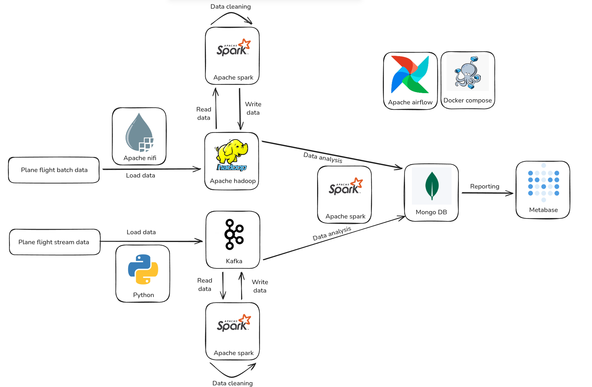

# Big Data Engineering - Flight Data Analysis Platform

The purpose of this project was to build a complete data engineering platform that processes large volumes of aviation data in both historical and real-time contexts. It represents a practical exploration of how modern big data tools can be used to construct scalable analytics systems.

## Architecture

The system is composed of two main processing layers with different data sources:
- Batch layer: processes historical flight data and produces long-term operational insights.
- Streaming layer: processes live aircraft telemetry and produces real-time analytics.

### Diagram

### Overview

Both batch and real-time pipelines follow a layered data architecture consisting of:
 - Raw zone
 - Curated zone
 - Transformed zone

Batch data ingestion is performed using **Apache NiFi** which load data into the raw data zone stored on **Apache Hadoop**. **Apache Spark** jobs are used to clean data, storing it in the curated zone on **Apache Hadoop**. Additional **Apache Spark** jobs are used to do analytical transformation which are stored in the **MongoDB**.

Live aircraft telemetry is ingested via a custom **Python producer** and stored into **Apache Kafka**.
**Spark Structured Streaming** is used for:
 - curating raw data and writing it into the **Apache Kafka**
 - transforming curated data and writing it into **MongoDB**.

**Metabase** is used to query transformed data from **MongoDB** and present analytical dashboards.

Batch data source: [link](https://www.kaggle.com/datasets/robikscube/flight-delay-dataset-20182022)

Real-time data source [link](https://openskynetwork.github.io/opensky-api/rest.html)
